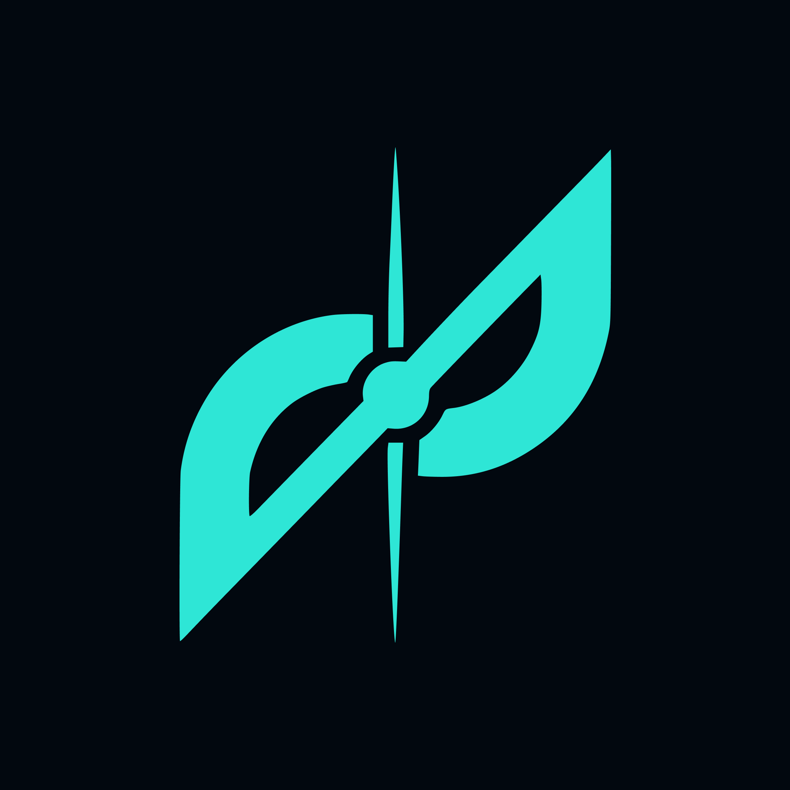

<p align="center">
  
</p>

<h1 align="center">DevMap</h1>

<p align="center">
Analyze once. Reuse context everywhere.
Structured project intelligence for developers and AI agents.
</p>

<p align="center">
  
  
  
  
</p>

> The first command you run after git clone.

Built by [Muhammad Fadil (@itsflaid)](https://github.com/itsflaid)

---

[Demo GIF placeholder — record before publishing]

---

## The Problem

Before doing real work, developers and AI agents need context.

They open files, trace dependencies, follow feature flows, and rebuild understanding of the project.

The process repeats every time you:

- start a new session
- switch AI tools
- bring in a new agent
- revisit a project weeks later

The code stays the same.

The context gets rebuilt again and again.

---

## The Solution

DevMap turns project knowledge into reusable context.

It analyzes your codebase and generates structured project intelligence that can be reused across developers, sessions, and AI agents.

Instead of rediscovering the codebase every time, agents and developers start with:

- Project overview
- Entry points
- Feature maps
- Critical files
- Architecture summaries
- Navigation paths
- Onboarding guidance

Analyze once.

Reuse everywhere.

Without DevMap:

```txt
Repository
   ↓
Claude explores files
   ↓
Context rebuilt

Repository
   ↓
Codex explores files
   ↓
Context rebuilt

Repository
   ↓
New session
   ↓
Context rebuilt
```

With DevMap:

```txt
Repository
   ↓
devmap analyze
   ↓
Shared Project Context
   ├─ Claude Code
   ├─ OpenAI Codex
   ├─ Gemini CLI
   ├─ Cursor
   ├─ Windsurf
   └─ Future Agents
```

---

## How It Works

```txt
devmap init
  → configures provider
  → generates DEVMAP.md
  → prepares project

devmap analyze
  → runs static analysis
  → builds project intelligence
  → generates navigation files
  → generates reusable context

Generated Context
  → reusable across sessions
  → reusable across agents
  → reusable across developers
```

---

## Generated Files

| File                      | Role                            |
| ------------------------- | ------------------------------- |
| `DEVMAP.md`               | DevMap project documentation    |
| `AGENTS.md`               | Agent instructions              |
| `.devmap/index.json`      | Agent entry point               |
| `.devmap/features/*.json` | Feature-level navigation        |
| `.devmap/snapshot.json`   | Complete project intelligence   |

Recommended navigation order for agents:

```txt
index.json
   ↓
feature map
   ↓
relevant source files
   ↓
snapshot.json (last resort)
```

The snapshot remains the complete project context and can also be copied into web-based AI tools when needed.

---

## For AI Agents

DevMap provides reusable project context that works across tools.

Instead of exploring a repository from scratch, agents start with generated project intelligence.

Supported workflows include:

- Claude Code
- OpenAI Codex
- Gemini CLI
- Cursor
- GitHub Copilot
- etc.

Without DevMap:

```txt
Agent
   ↓
Explore repository
   ↓
Trace dependencies
   ↓
Guess architecture
   ↓
Start task
```

With DevMap:

```txt
Agent
   ↓
index.json
   ↓
feature map
   ↓
relevant files
   ↓
Start task
```

One analysis.

Reusable across sessions, tools, and agents.

---

## Vision

DevMap is not an AI coding assistant.

AI coding assistants help write code.

DevMap helps developers and AI agents understand how codebases are organized, how features connect, and where work should begin.

Use DevMap to understand the project.

Use your preferred AI tool to change it.

> DevMap is a shared project context layer for developers and AI agents.

---

## Supported Stacks

### MVP

- React.js
- Next.js
- Node.js
- Express

### Planned

- Vue.js
- Nest.js
- Nuxt.js
- Php - Laravel
- All JS/TS ecosystem

Workspace classification can identify Astro packages, but deep Astro analysis
is not part of the current MVP support promise.

---

## AI Provider Setup

DevMap is free and open source.

AI features require a provider API key. DevMap uses Groq by default — analysis runs on free-tier infrastructure.

| Provider   | Status  |
| ---------- | ------- |
| Groq       | MVP     |
| OpenRouter | MVP     |
| OpenAI     | Planned |
| Gemini     | Planned |

`devmap init` lets you choose Groq or OpenRouter with the arrow keys. For
OpenRouter, pressing Enter at `OpenRouter model [openrouter/free]:` keeps the
free router; typing another model ID uses that free or paid model instead.
Change it later with `devmap config model <model-id>`.

API keys are stored locally:

```txt
~/.devmap/config.json
```

DevMap does not require a backend server.

Requests go directly from your machine to the selected provider.

---

## Installation

```bash
# npm
npm install -g devmap

# pnpm
pnpm add -g devmap

# run without installing
npx devmap analyze
```

Requirements:

```txt
Node.js 18+
```

---

## Roadmap

### MVP

- [x] `devmap init`
- [x] `devmap analyze`
- [x] `devmap ask`
- [x] `devmap onboarding`
- [x] `devmap doctor`

### Next

- [ ] `devmap enhance onboarding`
- [ ] `devmap features`
- [ ] `devmap flow`
- [ ] OpenAI provider
- [ ] Gemini provider

### Later

- [ ] `devmap explain`
- [ ] `devmap docs`
- [ ] Local AI mode

See [docs/roadmap.md](./docs/roadmap.md) for details.

---

## Documentation

- [PRD.md](./PRD.md)
- [docs/commands.md](./docs/commands.md)
- [docs/architecture.md](./docs/architecture.md)
- [docs/generated-files.md](./docs/generated-files.md)
- [docs/design.md](./docs/design.md)
- [docs/benchmarking.md](./docs/benchmarking.md)
- [docs/roadmap.md](./docs/roadmap.md)
- [docs/releasing.md](./docs/releasing.md)
- [CHANGELOG.md](./CHANGELOG.md)
- [CONTRIBUTING.md](./CONTRIBUTING.md)

---

## Contributing

DevMap is open source and welcomes contributions.

```bash
git clone https://github.com/itsflaid/devmap
cd devmap

npm install
npm link

devmap analyze
```

Before contributing:

1. Read `PRD.md`
2. Read `docs/architecture.md`
3. Read `CONTRIBUTING.md`

---

## License

MIT License — use it, fork it, improve it, build on top of it.
