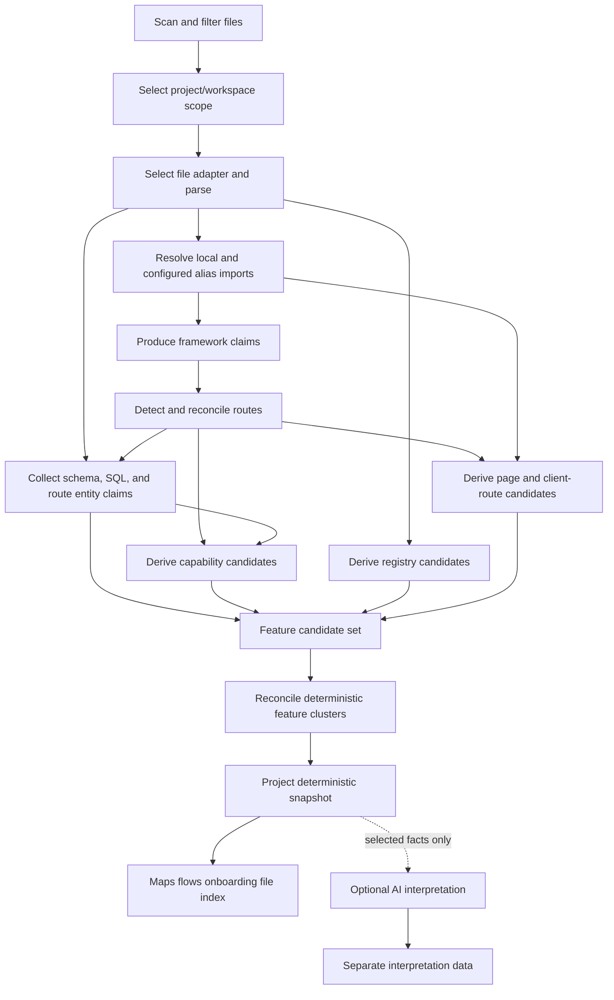
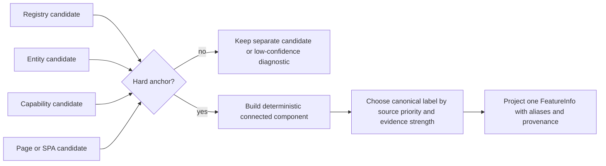
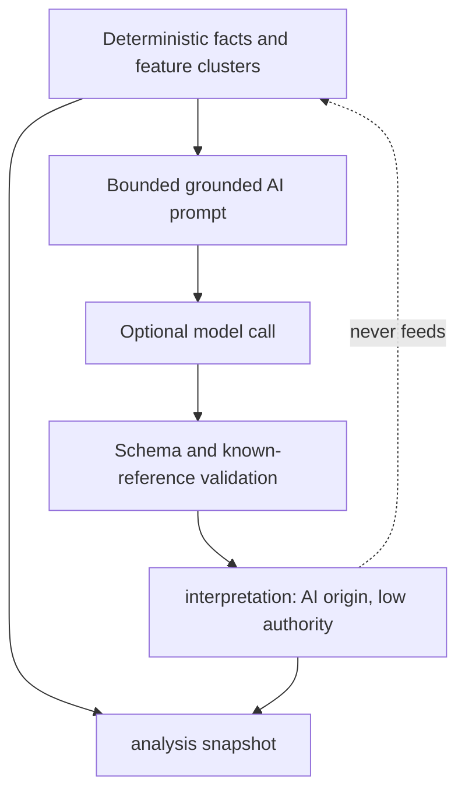
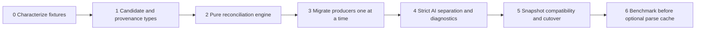

# DevMap Analyzer Architecture

**Status:** Current implementation assessment and **PROPOSED** stabilization
architecture. Updated 2026-08-29.

This is the architecture source of truth for DevMap's analyzer direction. It
replaces the former root-level reverse-engineering and V2 proposal documents.

## 1. Executive Decision

DevMap should evolve into an **evidence-first deterministic pass pipeline**.
It must not become a graph database, background service, or dynamic plugin
platform before there is a measured product need.

The current analyzer already has a valuable shape:

```text
scan → analyze → dependency graph → framework/routes/entities/capabilities
→ features → optional AI domain inference → ranking → flows → snapshot
```

The instability is primarily in the feature path, not in the existence of this
pipeline. Today several independent heuristics all create `FeatureInfo`, then a
single order-dependent similarity merge tries to decide whether they mean the
same thing. V2 keeps the lightweight CLI architecture, but makes candidates,
evidence, relationships, and reconciliation decisions explicit.

The target outcome is simple: each feature shown to a developer must answer
three questions reliably.

1. What domain area does this represent?
2. Which deterministic evidence supports it?
3. Why were related candidates merged, or deliberately kept separate?

## 2. Product Context and Constraints

DevMap is a local, on-demand TypeScript CLI (`@flaid/devmap`) for understanding
one project or a selected workspace scope. Its principal output is a JSON
snapshot plus navigation artifacts under `.devmap/`. Static analysis is the
source of truth; AI is an optional interpretation layer.

The following constraints are intentional:

- Supported JS/TS analysis uses TS-morph, with Vue/Svelte/Astro preprocessors.
- Other languages currently have a heuristic/fallback path and must report
  lower reliability honestly.
- The dependency graph is in-memory and file-level. A full run rebuilds it.
- Commands such as `map`, `flow`, `onboarding`, and `explain` rely on the
  snapshot projection rather than accessing analyzer internals.
- Phase 3 SPA support and Phase 6 multi-language support need extension seams,
  but do not justify an ecosystem-scale plugin runtime today.

**Non-goals:** a symbol/call graph across all languages, persisted graph store,
always-on watch service, full incremental derived-feature recomputation, and
AI-generated deterministic facts.

## 3. Current System Assessment

### 3.1 What already works well

- Scanner output is sorted after concurrent I/O, so downstream file order is
  reproducible on unchanged input.
- JS/TS has a real AST parser rather than only regex extraction.
- Route, entity, capability, page, and client-route detectors cover important
  full-stack and SPA patterns.
- The pipeline completes when AI is unavailable.
- Existing feature merge centralizes code that used to be duplicated.
- The current file graph is sufficient for bounded `map` traversal and basic
  page ownership when local relative imports resolve.

These are reasons to evolve rather than replace the analyzer.

### 3.2 Why feature output is unstable or misleading

The current feature pipeline creates candidates in this order:

```text
role feature → registry signal → capability → entity → frontend page
→ client route → optional AI domain feature
```

Each candidate is immediately compared with the current `features[]` list.
Consequently, a detector's order changes visible naming and grouping. The list
also mixes technical concerns (`Caching`), domain areas (`Workspace`), and
generic CRUD labels (`Workspace Management`) without a common identity.

The main observed failure modes are:

| Failure mode | Current cause | User-visible effect |
|---|---|---|
| Unrelated AI features merge | Empty files/entities are considered perfect Jaccard overlap | Missing or nonsensical domain feature |
| Domain duplicates | Page, entity, route, and capability candidates lack a stable shared identity | `Chat` plus `Chat Management` |
| False technical feature | Generic path/import substring matches are treated as sufficient evidence | `Authentication`, `Analytics`, etc. appear from incidental naming |
| False high confidence | Parser quality can promote a weak conclusion | A path heuristic is shown as reliable feature detection |
| Missing feature | Entity extractors stop at the first non-empty source | Thin Prisma/auth schemas suppress route-domain hints |
| Wrong entity | Route fallback promotes nested path segments to entities | `Member Management` inferred from an action/subresource |
| Incomplete ownership | Non-relative aliases are omitted from the file graph | Page feature lacks its real components/store/service |
| Opaque degradation | Parse errors fall through and unreadable files become empty content | Output looks complete when evidence is incomplete |
| Monorepo contamination | Framework detection reads all manifests but picks one winner per category | Routes/features from unrelated apps are mixed or skipped |

### 3.3 Required correction to the AI boundary

Current optional domain inference is not fully separated: AI domain features can
be merged into static `features[]`. This makes an interpretation look like a
deterministic fact. V2 corrects this without removing AI's usefulness.

## 4. Conceptual Model

V2 normalizes only the information that crosses detector boundaries. It does
not normalize every AST node into a universal code graph.

### 4.1 Facts, candidates, clusters, and projections

| Term | Meaning | May be generated by AI? |
|---|---|---|
| Observation | A direct parser, manifest, convention, or scan result | No |
| Deterministic fact | A typed, evidence-backed conclusion from observations | No |
| Feature candidate | A possible domain/technical feature produced by one deterministic rule | No |
| Feature cluster | Reconciled candidates that share a hard deterministic anchor | No |
| Projection | Public snapshot/CLI representation of facts and clusters | No |
| Interpretation | AI-authored domain label, summary, aliases, or prose linked to known facts | Yes, but only here |

A small common metadata wrapper is sufficient:

```ts
type Origin = "observed" | "derived" | "ai";
type Reliability = "high" | "medium" | "low";

interface Evidence {
  ruleId: string;
  detail: string;
  files?: string[];
  routePaths?: string[];
  entityNames?: string[];
  reliability: Reliability;
}

interface FactBase {
  id: string;
  origin: Origin;
  producedBy: string;
  evidence: Evidence[];
}
```

The fact catalog remains bounded: files, parsed files, import relations,
framework claims, routes, entities/entity relations, services, capabilities,
feature candidates/clusters, rankings, flows, and diagnostics. Symbols remain
inside parsed-file output until a concrete product feature requires dependable
cross-file symbol identity.

### 4.2 Analyzer flow



Every arrow is an explicit input/output contract. A pass can return diagnostics
but must not silently return an empty output after an exception.

## 5. File Adapters and Deterministic Passes

### 5.1 File adapter contract

Each file is handled by one deterministic adapter selected by capability and
priority: native AST > preprocessed native AST > heuristic > fallback. The
selected adapter, its version, and diagnostics are part of parsed-file output.

```ts
interface FileAdapter {
  id: string;
  version: string;
  supports(file: FileFact): "unsupported" | "fallback" | "native";
  analyze(file: FileFact, context: AdapterContext): Promise<ParsedFileFact>;
}
```

A native parser failure may use a fallback, but must emit a diagnostic and
downgrade observation reliability. A fallback must never look identical to a
successful native parse. Unreadable files must likewise produce an explicit
diagnostic rather than silent empty content.

### 5.2 Pass contract

Passes declare required and produced fact kinds. The fixed pipeline validates
missing producers, cycles, and conflicting exclusive producers at startup.
The default run order stays readable in code; V2 is not a dynamic query engine.

```ts
interface AnalysisPass<I, O> {
  id: string;
  version: string;
  requires: readonly I[];
  produces: readonly O[];
  run(input: FactQuery<I>, context: RunContext): Promise<PassResult<O>>;
}
```

Capability detection, for example, explicitly requires selected API-route facts
instead of relying on an upstream array that happened to omit page routes.

## 6. Feature Candidate Architecture

### 6.1 Candidate shape

All deterministic producers return candidates with their own evidence; none
writes directly into public `FeatureInfo`.

```ts
type FeatureCandidateSource =
  | "registry"
  | "capability"
  | "entity"
  | "frontend-page"
  | "client-route";

interface FeatureCandidate {
  id: string;
  label: string;
  source: FeatureCandidateSource;
  evidence: Evidence[];
  files: string[];
  routePaths: string[];
  entityNames: string[];
  conclusionConfidence: Reliability;
}
```

Candidates answer “what did this specific rule observe?” A cluster answers
“which candidates describe one developer-facing domain area?” This separation
prevents a route detector from deciding its own final product taxonomy.

### 6.2 Producer rules

#### Registry/technology candidates

Registry descriptors must classify evidence as one of:

- exact provider/framework package or API;
- boundary-aware import match;
- explicit path convention; or
- weak lexical hint.

Weak lexical hints can assist diagnostics or corroborate stronger evidence, but
cannot independently produce a high-confidence public feature. Raw substring
matching is not acceptable: `author` must not match the `auth` signal.

Technical candidates remain distinct from domain clusters by default. A project
may have `Caching` and `Workspace`; the former is not automatically part of the
latter because a workspace handler imports cache code.

#### Entity candidates

Prisma, SQL, and route hints all produce claims. They are reconciled by a
normalized entity identity with provenance preserved. A schema claim normally
outranks a route hint, but does not erase route evidence outside the schema's
coverage.

Route hints are low-confidence. The resource root can become an entity
candidate only if it has REST/handler/schema support. Nested segments such as
`members` in `/workspaces/[id]/members` remain subresource/action candidates
unless independently corroborated.

#### Capability candidates

Capability rules must record exact paths, methods, handlers, entities, and
signal categories. They count distinct semantic evidence, not merely the number
of route records: two HTTP methods on `/comments` do not establish a broader
social-interaction feature by themselves.

#### Frontend/page candidates

Page and client-route candidates use route seed files as hard evidence and the
dependency graph for owned implementation files. The existing conservative
ownership policy remains valid: a shared component is excluded rather than
misattributed. Alias imports must be resolved first when configuration supports
them.

## 7. Deterministic Reconciliation

### 7.1 Merge predicate

Similarity is an aid, not identity. Candidates may join a cluster only with at
least one hard anchor:

1. common normalized entity ID/name;
2. common route resource, handler, or route file;
3. shared non-generated implementation file; or
4. an explicit deterministic alias rule with a stable rule ID.

Name/trigram similarity can choose between already anchored alternatives, but
can never merge candidates on its own. Missing data is unknown—not a perfect
match. Scores normalize only across dimensions available on both sides; if no
dimension is comparable, they remain separate.

### 7.2 Reconciliation flow



Reconciliation receives the complete candidate set sorted by deterministic ID.
It must use connected components/union-find or a fixed-point merge so result is
independent of input order. A merge decision records the anchors, score
breakdown, accepted/rejected status, and canonical-name rationale.

The canonical label must be evidence-led, not first-seen. A suggested default
priority is: explicit domain route/entity cluster, frontend route area,
capability label, registry technical label. Exact policy must be versioned and
fixture-tested.

### 7.3 Confidence model

Reliability has two dimensions:

| Dimension | Question | Example |
|---|---|---|
| Observation reliability | Can DevMap trust the raw observation? | AST import is high; regex path hint is low |
| Conclusion confidence | Does the combined evidence establish this feature? | Multiple linked route/entity handlers can be high |

Rules may lower a source's reliability but must not increase it merely because
the parser was TS-morph. A public high-confidence feature needs direct,
corroborated deterministic evidence. AI output never receives deterministic
feature confidence.

## 8. Relationship and Graph Architecture

The default graph remains in-memory and file-level. It stores resolved local
imports/reexports and builds forward/reverse adjacency for maps, ownership, and
impact analysis. Full rebuild remains the default because no benchmark yet
proves incremental analysis necessary.

V2 adds only relationships that DevMap already reasons about:

- file imports/reexports;
- route handled by file;
- entity defined by schema/model file;
- entity relates to entity;
- capability supported by routes/entities;
- feature candidate supported by evidence; and
- flow traverses feature/route/file steps.

These relations carry evidence but are not forced into a generic property graph.
`fileGraph` remains a compatibility projection for `map`.

### Project/workspace scope

Scope selection happens before framework detection. The analyzer must not union
all manifests in a monorepo and then label all source files as one application.
The selected root/package scope is recorded in run metadata. Additional
workspaces may be analyzed explicitly in a later invocation or a deliberate
multi-project mode.

### Alias resolution

Before graph construction, parse supported alias mappings from relevant
TypeScript/framework configuration. Resolve only aliases declared by the
selected scope. If resolution fails, emit a diagnostic; never invent a graph
edge. Dynamic imports remain low-confidence unless a framework adapter provides
a reliable convention.

## 9. AI Interpretation Boundary

AI is permitted to infer a helpful domain label, summary, aliases, file-purpose
prose, and narrative explanation from selected deterministic facts. It is not
permitted to create deterministic features, routes, entities, capabilities,
relations, rankings, or flows.



`snapshot.analysis` contains deterministic output; `snapshot.interpretation`
or a compatibility-safe sidecar contains AI output. Interpretation must include
provider/model/template version, deterministic input fingerprint, timestamp,
and referenced fact IDs. Unknown references and schema-invalid response fields
are rejected. AI failure leaves deterministic analysis usable.

## 10. Snapshot and Compatibility

The current snapshot remains the public compatibility boundary. New internal
facts/candidates may be introduced behind a V1 projection first. If the public
snapshot changes:

1. publish an explicit schema version;
2. add a pure reader dispatcher for V1 and the new version;
3. keep V1 read support for a defined compatibility period; and
4. warn users to re-run `devmap analyze` when old data cannot faithfully supply
   required provenance.

Never silently convert V1 `high|medium|low` values into structured evidence;
that data does not exist in historical snapshots. Snapshot writes must be
atomic, so a failed analysis cannot leave mixed-schema JSON.

## 11. Diagnostics, Testing, and Observability

Normal CLI output should remain concise. A JSON diagnostic mode should expose:

- selected scope and competing framework claims;
- file-adapter counts, parse failures, and fallback use;
- unresolved aliases and import-resolution outcomes;
- candidate count by source and reliability;
- candidate evidence and rejected weak candidates;
- merge component membership, hard anchor, score breakdown, and canonical label;
- fact/snapshot counts and pass timing.

The regression suite must test the full feature pipeline, not only independent
helpers. Required fixtures include:

- unrelated AI domain suggestions with empty evidence;
- `Chat` page/API/entity reconciliation;
- insertion-order invariance and bridge-candidate clustering;
- Prisma auth schema plus independent API resources;
- nested route subresource handling;
- import substring collision such as `author` versus `auth`;
- alias imports and unresolved alias diagnostics;
- parser fallback diagnostics; and
- monorepo applications with conflicting framework manifests.

Every test must assert exact feature count/names, provenance, confidence, and
absence of known false positives. Assertions such as “at least one acceptable
name exists” are insufficient for regression prevention.

## 12. Migration Plan



### Phase 0 — Characterize

Capture approved snapshots and exact failure fixtures before behavior changes.
Mark existing false positives/negatives as intentionally corrected rather than
letting them appear as accidental regressions.

### Phase 1 — Candidate boundary

Add typed candidates/evidence and wrap existing producers without changing the
public snapshot. Keep legacy projection until candidate output is understood.

### Phase 2 — Reconciliation

Implement the pure order-independent reconciler with hard-anchor merging,
empty-data safety, and merge-decision diagnostics. This is the highest-risk
phase because it changes feature grouping; require fixture approval for every
visible difference.

### Phase 3 — Producer migration

Migrate registry, entity, capability, frontend, and client-route producers one
at a time. Preserve a reference test for each old behavior while explicitly
approving corrections. The entity-source union and alias resolution belong here.

### Phase 4 — AI and observability

Move AI domain output to interpretation data, forbid deterministic feedback,
and expose diagnostics. This is a behavior correction, not an optional
refactor.

### Phase 5 — Snapshot cutover

Ship V1/V2 reader compatibility and atomic writer logic before making a new
schema the default. Remove legacy internals only in a later reviewable change.

### Phase 6 — Performance decision

Benchmark scan, parse, graph, detector, memory, and snapshot-size costs on
representative repositories. Consider a per-file parse cache only if unchanged
parsing is a measured bottleneck and invalidation rules are tested. Global
detectors continue to rerun from complete facts in the first cache iteration.

## 13. Trade-offs and Deferred Work

This design adds types, tests, diagnostics, and reconciliation logic. It is more
work than a threshold tweak. That cost is justified because it makes feature
output explainable and prevents known correctness failures.

The current architecture remains better for simplicity in several areas:

- a full rebuild is safer than speculative incremental state;
- a file graph is simpler and more portable than a cross-language symbol graph;
- built-in adapters are easier to version and secure than runtime plugins; and
- snapshot-based commands need no database.

**Deferred until evidence justifies them:** public analyzer plugins, tree-sitter
adapters beyond planned language work, persisted graph storage, multi-project
aggregation, and fine-grained incremental derived-feature computation.

## 14. Implementation Reference

`task.md` is the execution plan for the stabilization work. It specifies the
required tests, work packages, acceptance criteria, verification commands, and
repository delivery rules. Implementation must follow it incrementally; do not
attempt this architecture as a single rewrite.
