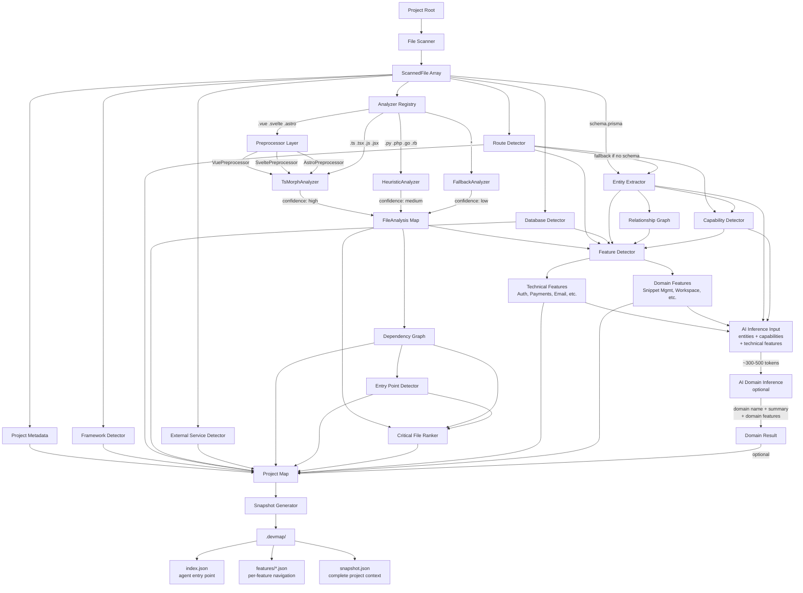

# DevMap — Architecture

← Back to Roadmap: ./roadmap.md

---

## Architecture Philosophy

DevMap follows this principle:

```txt
80% Static Analysis
20% AI Interpretation
```

Static analysis is the foundation. AI is an enhancement layer.

DevMap should not rely on AI to understand an entire project from raw source files. Instead, DevMap extracts structured project information first, then uses AI to interpret and explain that information.

---

## High-Level Flow

```txt
Project Files
  ↓
Scanner
  ↓
Preprocessor Layer        (Vue / Svelte / Astro)
  ↓
Analyzer Registry         (TsMorph / Heuristic / Fallback)
  ↓
Detector Layer            (Routes / Framework / Database / Services)
  ↓
Entity Extraction         (Prisma schema → route fallback)
  ↓
Capability Detection      (CRUD / Sharing / Collaboration / etc.)
  ↓
Feature Detection         (Technical + Domain features)
  ↓
AI Domain Inference       (optional — structured metadata only)
  ↓
Project Map Assembly
  ↓
Snapshot + Navigation Files
  ↓
Terminal Output
```

---

## Architecture Diagram



---

## Supported MVP Stacks

DevMap MVP targets fullstack web projects built with JavaScript and TypeScript:

| Stack | Status |
|---|---|
| Next.js | ✅ MVP |
| React + Express | ✅ MVP |
| Nuxt.js | ✅ MVP (via Vue preprocessor) |
| SvelteKit | ✅ MVP (via Svelte preprocessor) |
| Astro | ✅ MVP (via Astro frontmatter preprocessor) |
| Express (standalone) | ✅ MVP |

Frontend-only SPAs and non-web projects are planned post-MVP.

---

## Scanner

The scanner discovers project files.

### Responsibilities

- Traverse project directories
- Collect file metadata
- Apply ignore rules
- Return relevant source files

### Default Ignore Rules

```txt
node_modules/
.git/
.next/
dist/
build/
coverage/
.turbo/
.vercel/
out/
*.min.js
*.min.ts
*.map
*.lock
*.log
.env*
public/assets/
```

---

## Preprocessor Layer

Framework-specific file formats (.vue, .svelte, .astro) contain embedded JS/TS inside a larger format alongside templates, styles, and markup. ts-morph can only parse pure JS/TS, so these files go through a preprocessing step first.

### Source File Support

| File type | Parser | Confidence |
|---|---|---|
| `.ts` `.tsx` `.js` `.jsx` | ts-morph (AST) | high |
| `.vue` (Vue / Nuxt) | VuePreprocessor → ts-morph | high |
| `.svelte` (Svelte / SvelteKit) | SveltePreprocessor → ts-morph | high |
| `.astro` (Astro) | AstroPreprocessor → ts-morph | high |
| `.py` `.php` `.go` `.rb` | Heuristic (regex) | medium |
| Other | Fallback | low |

### Preprocessors

- **VuePreprocessor** — extracts `<script>` and `<script setup>` blocks, supports `lang="ts"`. Covers Vue and Nuxt.
- **SveltePreprocessor** — extracts `<script>` block, prefers instance script over module script. Covers Svelte and SvelteKit.
- **AstroPreprocessor** — extracts frontmatter between `---` fences. Always TypeScript.

Files without a script block return an empty medium-confidence result rather than crashing.

---

## Analyzer Registry

```txt
ScannedFile
  ↓
AnalyzerRegistry
  ├── TsMorphAnalyzer   (.ts .tsx .js .jsx + preprocessed .vue .svelte .astro)
  ├── HeuristicAnalyzer (.py .php .go .rb .cs etc.)
  └── FallbackAnalyzer  (everything else)
  ↓
FileAnalysis { analyzer, confidence, imports, exports, symbols, topFunctions }
```

`confidence` propagates through the pipeline — feature detection uses it to weigh evidence quality.

---

## Framework Detection

Framework detection uses `package.json` dependencies first, then file structure as secondary signal.

| Signal | Detection |
|---|---|
| `next` dependency | Next.js |
| `app/page`, `app/layout`, `app/route` | Next.js App Router |
| `pages/_app`, `pages/api` | Next.js Pages Router |
| `express` dependency + server file | Express |
| `react` + browser runtime | Standalone React |
| `vue` dependency | Vue / Nuxt |
| `svelte` dependency | Svelte / SvelteKit |
| `astro` dependency or `src/pages/*.astro` | Astro |

Express file-pattern detection is gated behind dependency check to prevent false positives on Next.js projects with `app.ts` utility files.

---

## Dependency Graph

Maps which files import which other files. Used for critical file detection, entry point detection, and context expansion.

---

## Feature Detection Pipeline

Feature detection runs in five layers. Layers 1–4 are static and deterministic. Layer 5 is AI-powered and optional.

### Layer 1 — Technical Features

Detected from library imports and dependency patterns. 15 signal categories:

Authentication, Payments, Email, File Upload, AI Integration, Caching, Search, Background Jobs, Logging & Monitoring, Testing, Internationalization, Analytics, Rate Limiting, CMS & Content, Notifications.

**AI Integration is import-only** — path matching disabled to prevent false positives from paths containing "ai", "model", "detail", "tailwind", etc.

Short terms (≤3 chars) use whole-word path matching: `"ai"` only matches `src/ai/` not `detail.tsx`.

### Layer 2 — Entity Extraction

Extracts domain entities from Prisma schema (high confidence) or falls back to route segment hints (low confidence).

```txt
schema.prisma → User, Snippet, Collection, Workspace, Order
/api/snippets → Snippet (route fallback when no schema)
```

Relation graph built from Prisma field types. Child entities (owned via one-to-many / many-to-many) are not surfaced as standalone features — they appear in their parent's purpose.

Extractor registry is multi-source ready: Drizzle, TypeORM, Mongoose support can be added by adding one file + one registration line.

### Layer 3 — Capability Detection

Detects what the project does from route HTTP methods and URL patterns.

| Signal | Capability |
|---|---|
| GET + POST + PUT + DELETE on resource | CRUD |
| `/share`, `/shareId` routes | Sharing |
| `/workspace`, `/members`, `/invite` | Collaboration |
| `/explore`, `/discover`, `/feed` | Discovery |
| `/like`, `/favorite`, `/reaction` | Social |
| `/publish`, `/draft` | Publishing |
| `/upload`, `/attachment` | File Management |
| `/stats`, `/analytics`, `/metrics` | Reporting |

### Layer 4 — Feature Assembly

Combines Layers 1–3 into `FeatureInfo[]`. No hardcoded domain names.

CRUD capability on entity "Snippet" → "Snippet Management". Capability "sharing" → "Content Sharing".

Entry points scored by relevance: route handlers score best (5), utils/helpers excluded (100).

### Layer 5 — AI Domain Inference

Compact structured metadata sent to AI — not raw source code:

```json
{
  "entities": ["Snippet", "Collection", "Workspace"],
  "capabilities": ["crud", "sharing", "collaboration"],
  "technicalFeatures": ["Authentication", "Database"],
  "routeCount": 35,
  "framework": "nextjs"
}
```

AI returns domain name, summary, and domain-specific features. Token usage: ~300–500 per analysis. Falls back gracefully if AI unavailable.

### What is NOT a Feature

These are architectural concerns, not domain features. They live in `snapshot.routes`, `snapshot.database`, and `snapshot.fileIndex`:

- API Routes, Database
- API Layer, Service Layer, Middleware, Data Access Layer
- UI Components (belong to their respective domain feature)

---

## Snapshot

### File Structure

```txt
.devmap/
  index.json          ← agent entry point (lightweight)
  features/*.json     ← per-feature navigation maps
  snapshot.json       ← complete project context
```

### Folder Strategy (Current + Future)

```txt
.devmap/
  snapshot.json       ← static analysis output, regenerated by `devmap analyze`
  index.json          ← lightweight agent entry point
  features/           ← per-feature navigation maps

  [future — Phase 5]
  agent/
    context.json      ← persistent reusable context
    knowledge.json    ← validated business knowledge
    glossary.json     ← project terminology
    decisions.json    ← architectural decisions
    tasks.json        ← optional long-term agent task state
```

`devmap analyze` only regenerates the static analysis artifacts (`snapshot.json`,
`index.json`, and `features/`). Files inside `.devmap/agent/` are owned by the
Agent Layer and are preserved across analyses, allowing AI agents to accumulate
validated project knowledge without modifying the reproducible static snapshot.

`devmap analyze` only regenerates the static files. Future agent knowledge persists independently in `knowledge/`.

### Snapshot Rules

- Must not contain full raw project source
- Must be compact and deterministic
- Must include schema version
- Must be regenerated by `devmap analyze`
- AI enrichment is batched and optional — analyze continues if enrichment fails

---

## Generated Files Strategy

```txt
Committed to git (user-editable):
  DEVMAP.md     ← DevMap usage instructions, generated once on init
  AGENTS.md     ← AI agent instructions, never overwritten

Gitignored (always regeneratable):
  .devmap/      ← all generated artifacts
```

`DEVMAP.md` in the project root is the only public signal that a project uses DevMap. Developers who clone the repo run `devmap analyze` to regenerate `.devmap/` locally.

---

## Context Builder

Selects relevant project context before sending anything to AI.

### MVP Strategy (no embeddings)

- File path matching
- Keyword matching
- Import/export matching
- Dependency matching
- Known framework conventions

### Relevance Scoring

| Confidence | Score |
|---|---|
| high | 70+ |
| medium | 40+ |
| low | < 40 |

Files below score 25 are excluded.

---

## AI Layer

All AI interactions go through a provider abstraction.

### Current Providers

- Groq
- OpenRouter
- Custom (any OpenAI-compatible endpoint — self-hosted or third-party)

### Extensibility

The provider interface is designed to support additional AI providers without changing the command layer.

Examples include OpenAI, Gemini, and Ollama.

---

## Architecture Boundaries

| Layer | Responsibility | Must NOT |
|---|---|---|
| Commands | Orchestrate behavior | Contain heavy analysis logic |
| Scanner | Discover files | Call AI |
| Preprocessors | Extract JS/TS from framework files | Parse AST |
| Analyzer | Extract file structure | Call AI directly |
| Feature Detector | Classify capabilities | Hardcode domain names |
| Entity Extractor | Build entity graph | Know feature names |
| Capability Detector | Detect behaviors from routes | Know entity schemas |
| Context Builder | Select relevant context | Format terminal output |
| AI Layer | Communicate with providers | Scan files directly |
| Output Layer | Format terminal messages | Contain business logic |

---

## Source of Truth

| Topic | File |
|---|---|
| Product direction | `docs/roadmap.md` |
| Command behavior | `docs/commands.md` |
| Generated file behavior | `docs/generated-files.md` |
| Benchmarking | `docs/benchmarking.md` |
| Roadmap | `docs/roadmap.md` |
