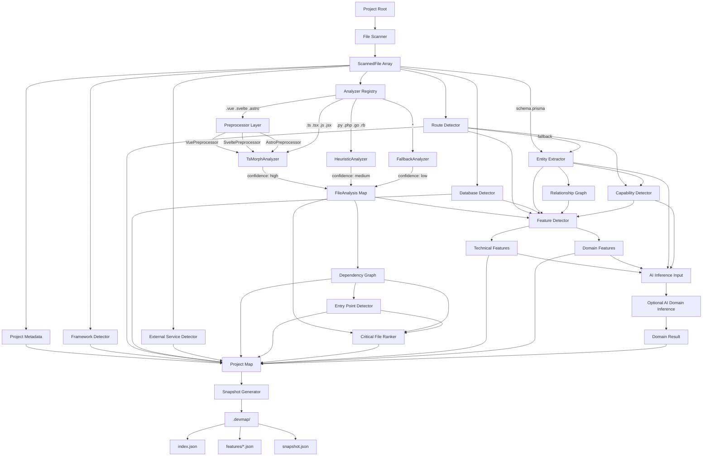

# DevMap — Architecture (Revised)

> **Note:** This is a revised architecture aligned with the latest roadmap.

## Architecture Philosophy

```text
80% Static Analysis
20% AI Interpretation
```

Static analysis is the source of truth.
AI interprets structured metadata rather than raw source code.

---

## High-Level Architecture



---

## Generated Structure

```text
.devmap/
├── snapshot.json
├── index.json
├── features/
│   ├── authentication.json
│   └── ...
├── maps/                 (Phase 2)
├── flows/                (Phase 2)
├── onboarding.md         (Phase 2)
└── agent/                (Phase 5)
```

### Current (Phase 1)

- snapshot.json
- index.json
- features/*.json

### Phase 2

- maps/
- flows/
- onboarding.md

### Phase 5

- agent/
- incremental context
- working memory
- smart cache

---

## Architecture Principles

1. Static analysis is always the source of truth.
2. AI never discovers project facts from raw source.
3. Snapshot is immutable until `devmap analyze`.
4. Agent runtime data never overwrites snapshot.
5. Context Builder combines:
   - snapshot
   - feature maps
   - generated docs
   - agent context (future)

---

## Agent Layer (Future)

Agent Layer is planned for Phase 5.

It stores runtime context only:

```text
.devmap/agent/
├── context.json
├── cache.json
├── history.json
└── state.json
```

This directory is intentionally separated from `snapshot.json`.

Snapshot contains project facts.

Agent contains temporary runtime knowledge.

